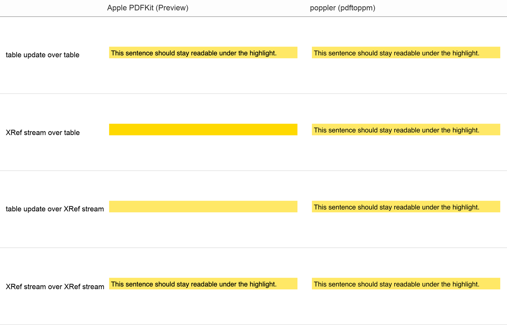
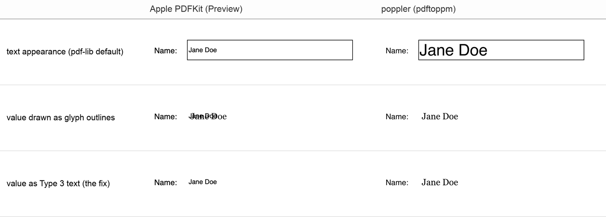

# pdfkit-pitfalls

Two ways a PDF that renders fine in pdf.js, pdfium and poppler breaks in Apple's PDFKit, the engine behind Preview, the iOS Files app and PDFs in Safari. Each one is reproduced by a small script, rendered with PDFKit and with poppler side by side.

We ran into both while building a browser-based PDF editor ([LensUp's PDF editor](https://lensup.ai/pdf-editor/), which we make).

## 1. An incremental update in a different cross-reference form

An incremental update appends to a PDF. If the original ends in a classic `xref` table and the update ends in an XRef stream with object streams (pdf-lib's default when saving), PDFKit reports `missing or invalid cross-reference stream` and loses the objects in the update's object stream. The reverse, a table-based update over an XRef stream, gets `failed to find start of cross-reference section` and loses the objects in the original's object streams. Here the lost object is a highlight's ExtGState (opacity 0.6, Multiply) in one case and the page's font in the other:



**Fix:** write the update in the same form as the original's last cross-reference section. Check whether the last `startxref` offset lands on the keyword `xref` (a table) or on an object (a stream), and save with `useObjectStreams` set to match. See `xrefForm()` in [the write-up](#write-up).

## 2. PDFKit draws a filled text field's value itself

For a text field with a value, PDFKit draws `/V` with CoreText in the `/DA` font and drops the text-showing operators (`BT … Tj … ET`) of the field's appearance stream, but it still paints the rest of the appearance, such as paths. An appearance that draws the value as glyph outlines therefore shows up twice:



**Fix:** write the value as text in a Type 3 font whose glyph procedures are the outlines. PDFKit drops it and draws the value once; other readers draw the Type 3 glyphs.

## Run it

Requirements: macOS with the Swift toolchain (Xcode or the Command Line Tools), Node 18 or newer, and optionally poppler (`brew install poppler`) for the comparison renders.

```sh
npm install
./run.sh
```

`run.sh` writes the PDFs to `out/`, renders each one with PDFKit (printing CoreGraphics' complaints, via `CG_PDF_VERBOSE=1`) and with `pdftoppm`, and leaves the PNGs next to them. Expected output:

```
xref-stream-update-over-table   PDFKit: encountered unexpected object type: 7. missing or invalid object number. missing or invalid cross-reference stream.
xref-table-update-over-stream   PDFKit: failed to find start of cross-reference section. font `Helvetica-…' not found in document.
```

and no messages for the other files.

| File | What it does |
|---|---|
| `xref-demo.mjs` | Writes an original with a classic table and one with an XRef stream, then appends the same highlight to each, in both forms |
| `field-demo.mjs` | Writes one filled text field three ways: pdf-lib's text appearance, the value as glyph outlines, the value as Type 3 text |
| `render-pdfkit.swift` | Renders page 1 of a PDF with PDFKit (`PDFPage.draw`, form widgets included) to a PNG |
| `run.sh` | Builds and renders everything |

`field-demo.mjs` uses Georgia from macOS for the outlines so the two layers look different; pass another `.ttf` as the first argument to change it.

## Write-up

The full write-up, including a third issue with Adobe's Reader extensions (`/UR3`) and notes on testing with PDFKit: [Fine in Chrome, broken in Preview: two PDFKit gotchas for anyone who writes PDFs](https://wangyan.hashnode.dev/fine-in-chrome-broken-in-preview-two-pdfkit-gotchas-for-anyone-who-writes-pdfs).

## License

MIT
